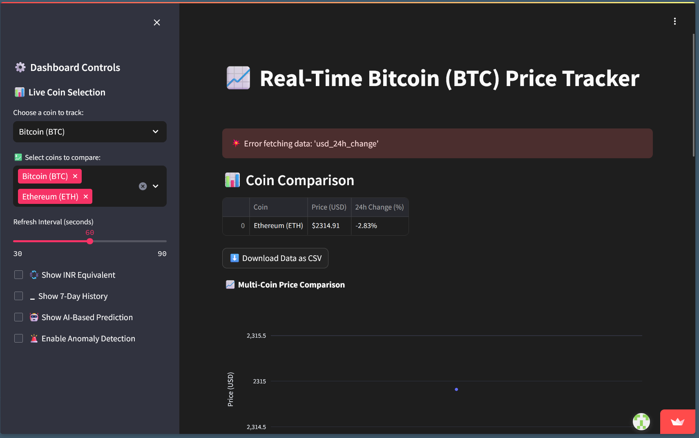
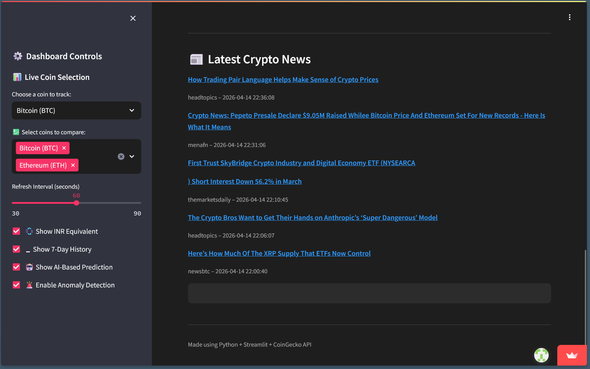
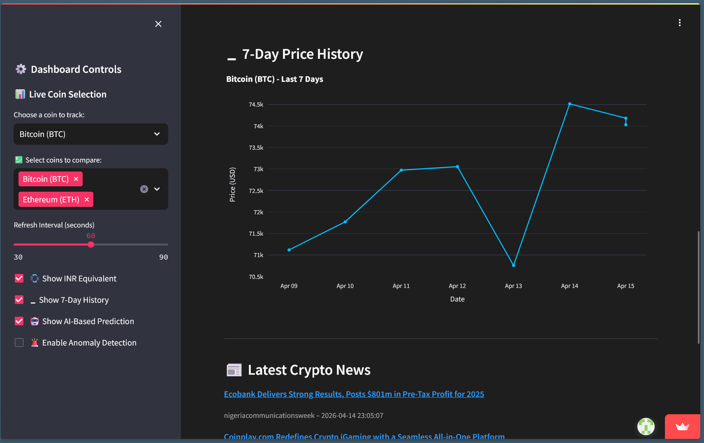
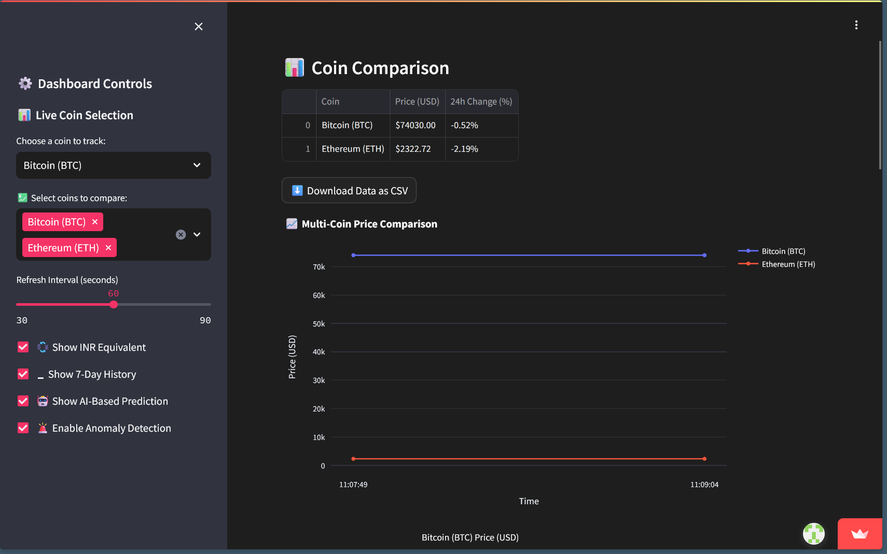
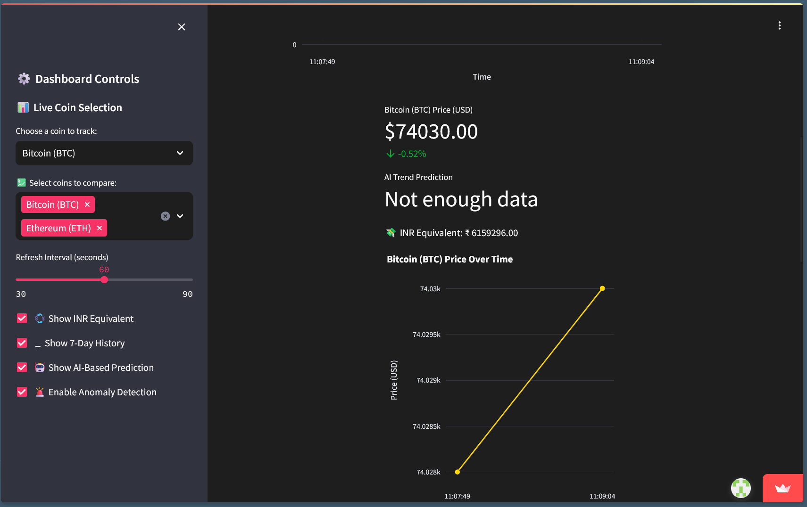

# 💹 Real-Time Crypto Dashboard

A fully interactive and responsive real-time cryptocurrency dashboard built using **Python**, **Streamlit**, and **Plotly**, featuring:

- 📈 Live price tracking for Bitcoin, Ethereum, Dogecoin, and Litecoin  
- 📊 Multi-coin comparison with chart and table  
- 🧠 AI-powered trend prediction (Linear Regression)  
- 🚨 Price anomaly detection using Z-Score  
- 📰 Live crypto news updates via NewsData.io API  
- 💱 INR currency conversion  
- 📉 7-day price history  
- ⬇️ CSV export for comparative data  
- 🔄 Auto-refresh control

▶️ **Live Demo**: [Streamlit App](https://real-time-crypto-dashboard-by4dxgqjesnhgbbe4jnjds.streamlit.app)  
👤 **Author**: [NithisaMurugesan](https://github.com/NithisaMurugesan)

---

## 📸 Preview

) 

---

## 🚀 Features

### 🔍 Live Coin Tracker
- Displays the selected coin’s live USD price and 24-hour percentage change.
- Converts live price to INR on demand.

### 📈 AI Trend Prediction
- Uses **Linear Regression** to predict the next price point.
- Displays trend as 🔼 Uptrend or 🔽 Downtrend.

### 🚨 Price Anomaly Detection
- Calculates z-score of current price based on recent values.
- Triggers alert if the current price is statistically abnormal.

### 🗓️ Historical Data
- Shows past 7 days of daily prices for selected coin.
- Visualized with an interactive Plotly chart.

### 📊 Multi-Coin Comparison
- Compares BTC, ETH, DOGE, LTC side-by-side.
- Includes real-time table and live chart updates.

### 📰 Live Crypto News
- Integrates with [NewsData.io](https://newsdata.io/) API.
- Displays up to 5 latest relevant crypto news articles.

---

## 🛠️ Tech Stack

| Component | Description |
|----------|-------------|
| `Streamlit` | Web app framework |
| `Plotly` | Data visualization |
| `Pandas` | Data manipulation |
| `NumPy` | Numerical operations |
| `Scikit-learn` | Linear regression model |
| `NewsData.io` | News API |
| `CoinGecko API` | Crypto pricing data |
| `Python` | Core language |

---

## 📦 Installation

```bash
git clone https://github.com/NithisaMurugesan/real-time-crypto-dashboard.git
cd real-time-crypto-dashboard
pip install -r requirements.txt
streamlit run app.py


DASHBOARD DEMO SCREENSHOTS --->
## 📸 Dashboard Demo Screenshots

### 🎛️ Controls & Coin Comparison


### 📰 Crypto News


### 📊 7-Day Chart


### 📈 Multi-Coin Comparison


### 🤖 AI Trend Analysis
